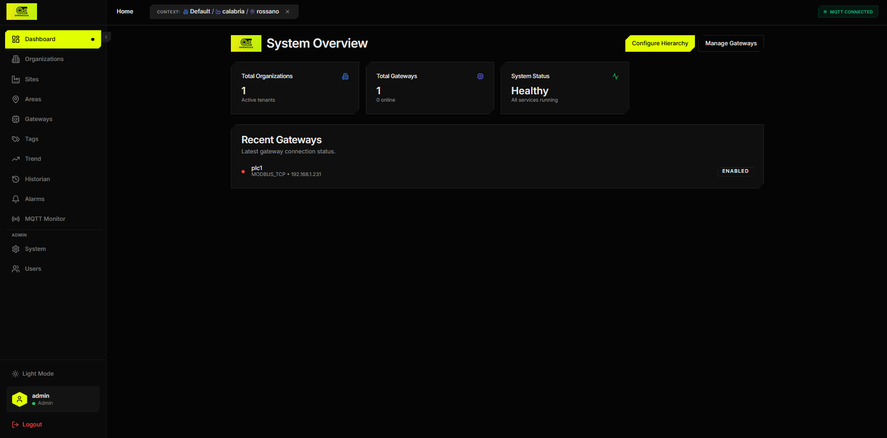
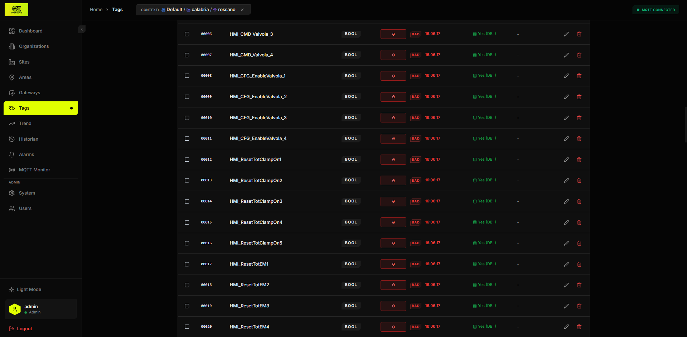
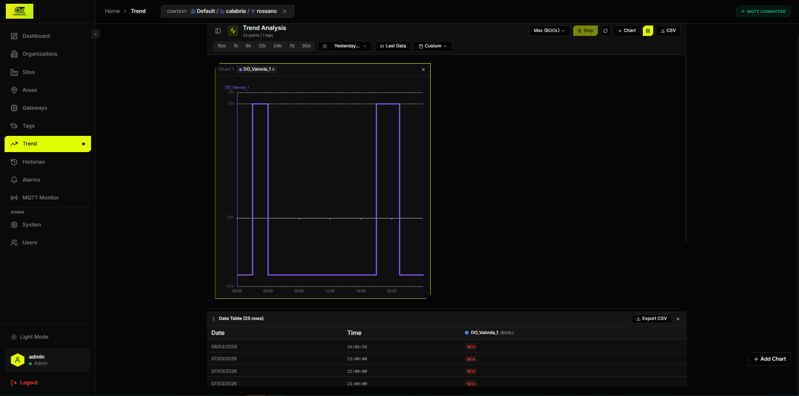
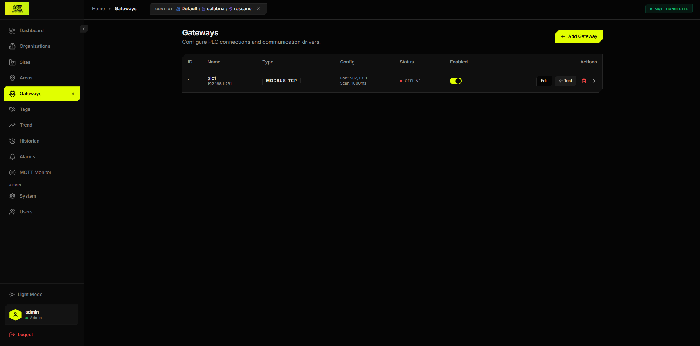

# OpenEdge Industrial Edge Middleware

<div align="center">


**Production-Ready Industrial IoT Edge Computing Platform**

[](https://golang.org/)
[](LICENSE)
[](https://www.docker.com/)

⚡ **High-Performance** • 🏭 **Industrial-Grade** • 🔒 **Secure** • 📊 **Real-Time Analytics**

</div>

---

## 🚀 Overview

**OpenEdge** is a professional-grade edge computing middleware designed for industrial IoT applications. It bridges the gap between industrial PLCs/field devices and cloud systems, providing real-time data collection, alarm management, and secure cloud synchronization.

### Key Features

- **🔄 Multi-Protocol Support**: Modbus TCP, Siemens S7, OPC UA, MQTT, Redis
- **⚡ Real-Time Data Processing**: Sub-millisecond latency with Redis caching
- **🚨 Advanced Alarm System**: Configurable thresholds, delays, and hysteresis
- **📡 Cloud Sync**: Bidirectional MQTT forwarding with Sparkplug B support
- **🔒 End-to-End Security**: AES-256 encryption, authentication, TLS support
- **📊 Time-Series Database**: TimescaleDB integration with automatic retention policies
- **🎨 Modern Web UI**: React-based dashboard with dark/light themes
- **🐳 Production-Ready**: Docker Compose deployment, health checks, auto-reconnection

---

## 📋 Table of Contents

- [Quick Start](#-quick-start)
- [Architecture](#-architecture)
- [Configuration](#-configuration)
- [Deployment](#-deployment)
- [API Documentation](#-api-documentation)
- [Development](#-development)
- [Contributing](#-contributing)
- [License](#-license)

---

## ⚡ Quick Start

### Prerequisites

- Docker & Docker Compose
- Go 1.21+ (for development)
- Node.js 20+ (for UI development)

### Start with Docker

```bash
# Clone the repository
git clone https://github.com/your-org/openedge.git
cd openedge

# Copy environment template
cp .env.example .env

# Start all services
docker-compose up -d

# Access the web UI
open http://localhost:80
```

**Default Credentials:**
- Username: `admin`
- Password: `admin123` (change immediately after first login)

### Services Started

| Service | Port | Description |
|---------|------|-------------|
| Web UI | 80 | React dashboard |
| Core API | 8081 | REST API & WebSocket |
| Mosquitto | 18830 | MQTT broker |
| PostgreSQL | 5432 | TimescaleDB |
| Redis | 6379 | Cache & real-time data |

---

## 📸 Screenshots

### Home Dashboard


### Tag Browser


### Real-Time Trend


### Cloud Gateway Configuration


---

## 🏗️ Architecture

```
┌─────────────────────────────────────────────────────────────┐
│                         OpenEdge                            │
├─────────────────────────────────────────────────────────────┤
│                                                               │
│  ┌─────────────┐    ┌──────────────┐    ┌──────────────┐  │
│  │   Drivers   │───▶│ Engine Historian│───▶│  Cloud Sync  │  │
│  │             │    │              │    │              │  │
│  │ • Modbus    │    │ • Real-time   │    │ • Sparkplug B│  │
│  │ • S7        │    │   History     │    │ • Forwarding │  │
│  │ • OPC UA    │    │ • Alarms      │    │ • Commands   │  │
│  │ • MQTT      │    │ • Deadband    │    │              │  │
│  │ • Redis     │    │ • Compression │    │              │  │
│  └─────────────┘    └──────────────┘    └──────────────┘  │
│         │                                      │           │
│         ▼                                      ▼           │
│  ┌─────────────┐    ┌──────────────┐    ┌──────────────┐  │
│  │  PostgreSQL │    │    Redis     │    │  Cloud MQTT  │  │
│  │ TimescaleDB │◀──▶│    Cache     │    │              │  │
│  └─────────────┘    └──────────────┘    └──────────────┘  │
│                                                               │
└─────────────────────────────────────────────────────────────┘
```

---

## ⚙️ Configuration

### Environment Variables

```bash
# Database
DB_HOST=postgres
DB_PORT=5432
DB_USER=industrial_user
DB_PASSWORD=industrial_pass
DB_NAME=industrial_edge

# MQTT
MQTT_HOST=mosquitto
MQTT_PORT=1883

# Redis
REDIS_HOST=redis
REDIS_PORT=6379

# Cloud Sync (Optional)
CLOUD_SYNC_ENABLED=false
CLOUD_MQTT_HOST=
CLOUD_MQTT_PORT=1883
CLOUD_MQTT_USERNAME=
CLOUD_MQTT_PASSWORD=
CLOUD_MQTT_TOPIC=

# Encryption (Optional)
ENCRYPTION_KEY= # 32-character key for AES-256
```

### Alarm Configuration

Alarms are configured per tag with:
- **Thresholds**: High/Limit limits with hysteresis
- **Delays**: Time delay before triggering (seconds)
- **Severity**: Critical, Warning, Info
- **Actions**: MQTT publish, database logging, UI notifications

---

## 🚀 Deployment

### Production Deployment

```bash
# Build production images
docker-compose -f docker-compose.yml build

# Start with production configuration
docker-compose --env-file .env.prod up -d

# Check service health
docker-compose ps
```

### System Requirements

**Minimum:**
- CPU: 2 cores
- RAM: 4 GB
- Disk: 20 GB SSD

**Recommended (100+ tags):**
- CPU: 4 cores
- RAM: 8 GB
- Disk: 100 GB SSD

---

## 📚 API Documentation

### REST API Endpoints

```
GET  /api/health          # Health check
GET  /api/tags            # List all tags
GET  /api/tags/:id        # Get tag details
POST /api/tags/:id/write  # Write tag value
GET  /api/alarms          # List alarms
GET  /api/history         # Historical data
GET  /api/system          # System settings
PUT  /api/system          # Update settings
```

### WebSocket

```
ws://localhost:8081/ws/realtime
```

Real-time tag value updates, alarm notifications, and system events.

---

## 🛠️ Development

### Prerequisites

```bash
# Install Go dependencies
go mod download

# Install UI dependencies
cd services/web-ui
npm install
```

### Build Services

```bash
# Build all Go services
go build ./services/...

# Build UI
cd services/web-ui
npm run build
```

### Run Locally

```bash
# Start PostgreSQL, Redis, Mosquitto
docker-compose up -d postgres redis mosquitto

# Start services
./services/core-api/core-api &
./services/engine-historian/engine-historian &
./services/driver-modbus/driver-modbus &

# Start UI
cd services/web-ui && npm run dev
```

---

## 📖 Documentation

- [Alarm System Guide](docs/alarms.md)
- [Driver Configuration](docs/drivers.md)
- [API Reference](docs/api.md)
- [Deployment Guide](docs/deployment.md)
- [Troubleshooting](docs/troubleshooting.md)

---

## 🤝 Contributing

We welcome contributions! Please see [CONTRIBUTING.md](CONTRIBUTING.md) for guidelines.

### Development Workflow

1. Fork the repository
2. Create a feature branch (`git checkout -b feature/amazing-feature`)
3. Commit your changes (`git commit -m 'Add amazing feature'`)
4. Push to the branch (`git push origin feature/amazing-feature`)
5. Open a Pull Request

---

## 📜 License

This project is licensed under the MIT License - see the [LICENSE](LICENSE) file for details.

---

## 🙏 Acknowledgments

Built with:
- [Golang](https://golang.org/) - Core platform
- [TimescaleDB](https://www.timescale.com/) - Time-series database
- [Eclipse Mosquitto](https://mosquitto.org/) - MQTT broker
- [React](https://reactjs.org/) - Frontend framework
- [Sparkplug B](https://sparkplug.eclipse.org/) - Industrial IoT standard

---

## 📧 Support

- **Documentation**: [https://docs.openedge.io](https://docs.openedge.io)
- **Issues**: [GitHub Issues](https://github.com/your-org/openedge/issues)
- **Discussions**: [GitHub Discussions](https://github.com/your-org/openedge/discussions)

---

<div align="center">

**Made with ❤️ for the Industrial IoT Community**

</div>
