<div align="center">

<table border="0" cellspacing="0" cellpadding="0">
  <tr>
    <td align="center" valign="middle" width="160">
      
    </td>
    <td align="center" valign="middle" width="40"></td>
    <td align="center" valign="middle" width="220">
      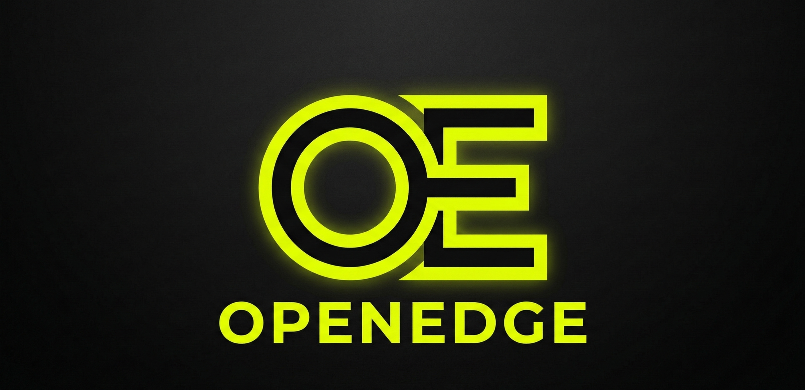
    </td>
  </tr>
</table>

# OpenEdge Industrial Edge Middleware

**Multi-Tenant SaaS Industrial IoT Platform**

[](https://openedge-landing.vercel.app)
[](https://golang.org/)
[](LICENSE)
[](https://www.docker.com/)
[](https://www.cesmii.org/)

⚡ **High-Performance** • 🏭 **Industrial-Grade** • 🔒 **Secure** • 🌐 **Multi-Tenant SaaS**

**[🌐 Visit the Landing Page →](https://openedge-landing.vercel.app)**

</div>

---

## Screenshots

<table>
  <tr>
    <td align="center"><b>Dashboard</b></td>
    <td align="center"><b>Gateways</b></td>
    <td align="center"><b>Tags</b></td>
  </tr>
  <tr>
    <td>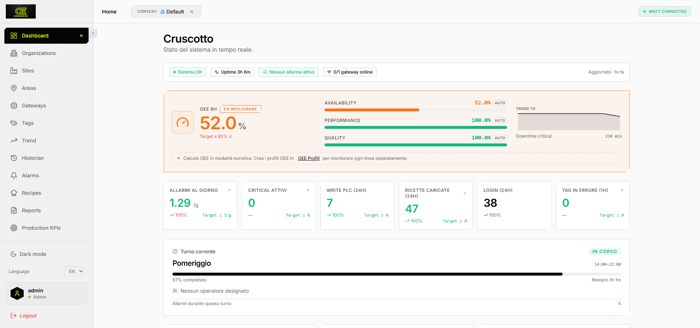</td>
    <td>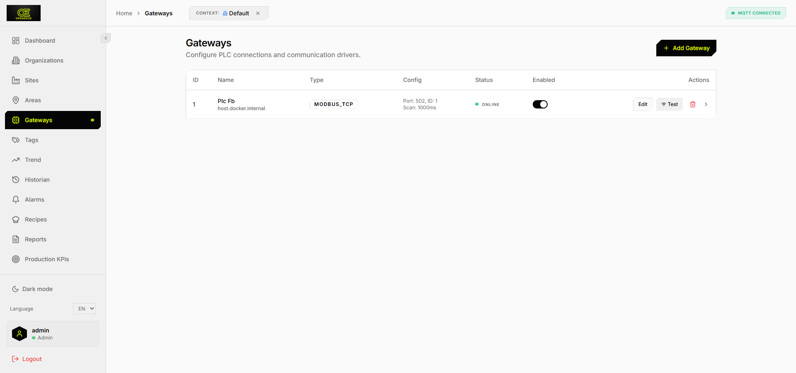</td>
    <td>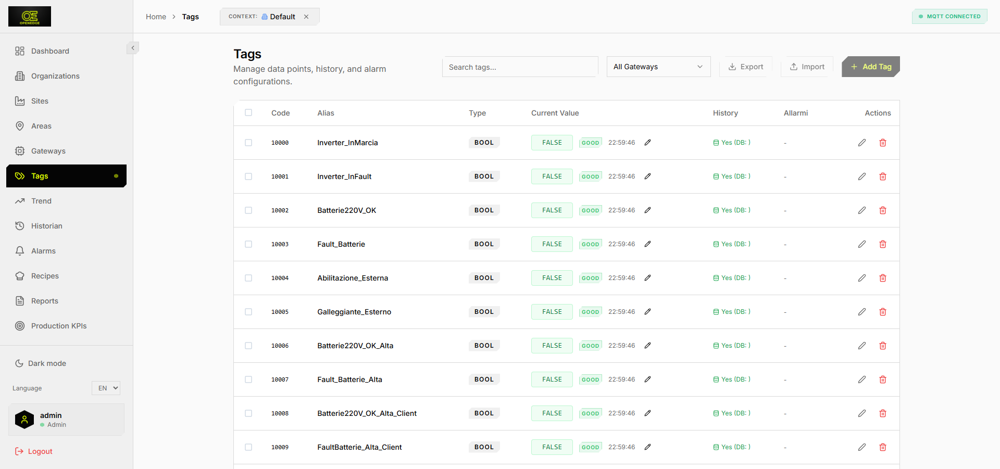</td>
  </tr>
  <tr>
    <td align="center"><b>Trend</b></td>
    <td align="center"><b>Alarms</b></td>
    <td align="center"><b>Recipes</b></td>
  </tr>
  <tr>
    <td>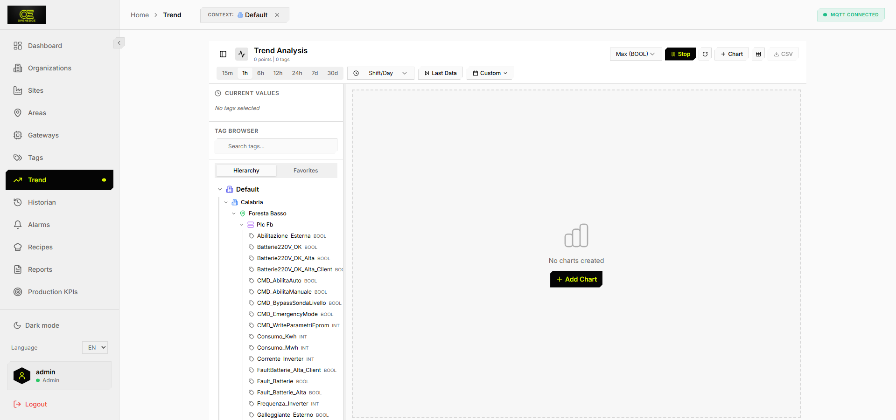</td>
    <td>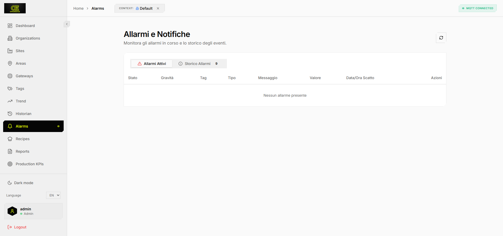</td>
    <td>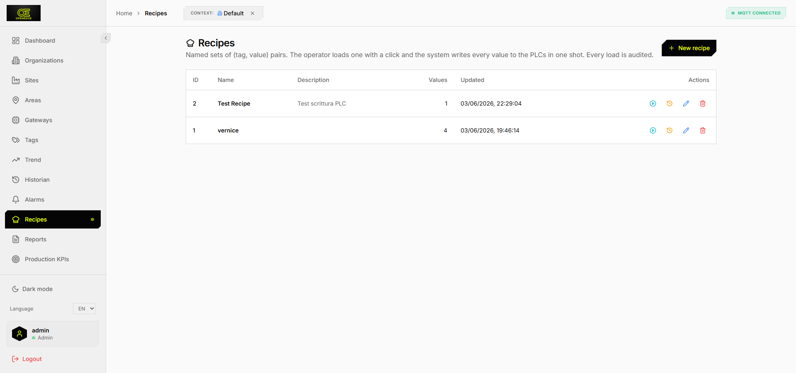</td>
  </tr>
  <tr>
    <td align="center"><b>KPIs</b></td>
    <td align="center"><b>CESMII i3X</b></td>
    <td align="center"><b>MQTT Monitor</b></td>
  </tr>
  <tr>
    <td>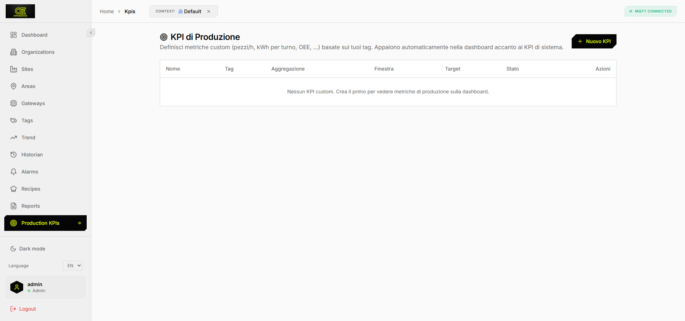</td>
    <td>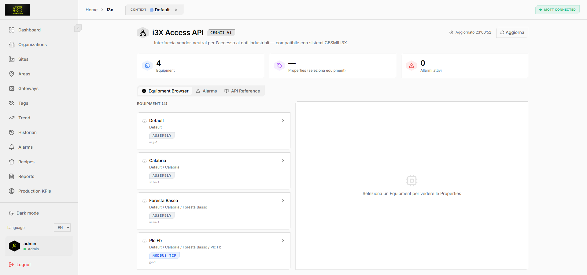</td>
    <td>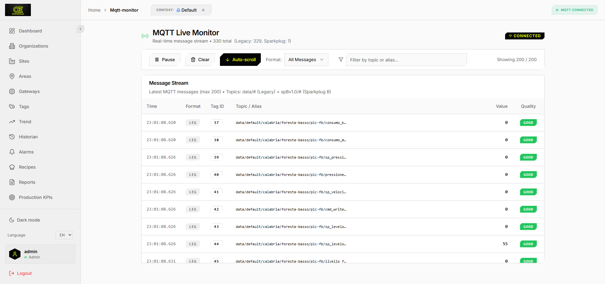</td>
  </tr>
  <tr>
    <td align="center"><b>Historian</b></td>
    <td align="center"><b>Maintenance</b></td>
    <td align="center"><b>Diagnostics</b></td>
  </tr>
  <tr>
    <td>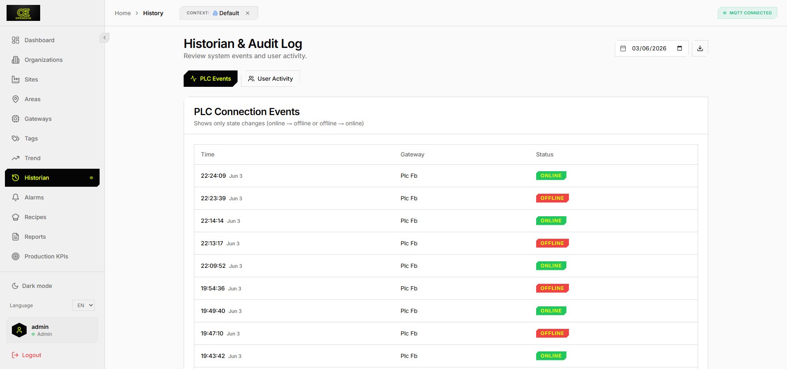</td>
    <td>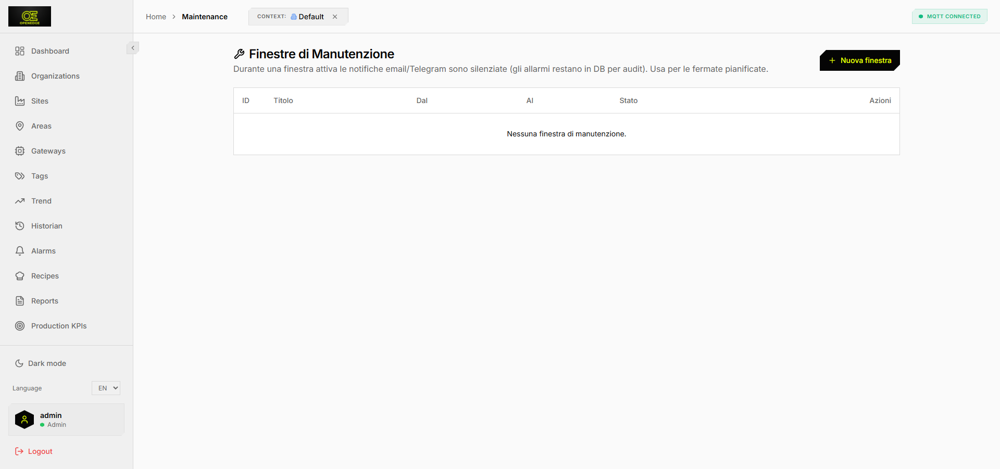</td>
    <td>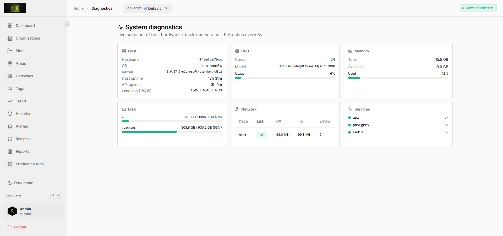</td>
  </tr>
</table>

---

## Overview

**OpenEdge** is a production-ready, multi-tenant SaaS platform for Industrial IoT. It bridges the gap between field devices (PLCs, sensors) and cloud systems — providing real-time data collection, alarm management, OEE analytics, and a vendor-neutral REST API compatible with the **CESMII i3X v1** standard.

Each customer organization is fully isolated: siloed data, siloed MQTT credentials, siloed users. The global admin manages organizations; each org's admin manages their own users and infrastructure autonomously.

### Key Features

**Data & Control**
- **Multi-Protocol Drivers** — Modbus TCP, Siemens S7, OPC UA, MQTT, Redis
- **Real-Time Processing** — Sub-second latency with Redis caching and WebSocket push
- **Time-Series Database** — TimescaleDB with automatic retention policies
- **Write Commands** — Bidirectional PLC control via MQTT (i3X write permission)
- **Sparkplug B** — Dual format support (plain MQTT + Sparkplug B)

**Alarms & Analytics**
- **Advanced Alarm System** — Configurable thresholds, delays, hysteresis, per-tag ACK
- **OEE Engine** — Multi-profile, shift-aware, ISO 22400 Six Big Losses
- **AI-Ops Endpoints** — Z-score anomaly detection, alarm digest, org snapshot
- **Custom KPIs** — Operator-defined metrics with window aggregation
- **CSV Reports** — History, alarms, audit log exports

**Multi-Tenant SaaS**
- **Organization Isolation** — Data, MQTT, users all scoped per org
- **Per-Org MQTT Auth** — Automatic Mosquitto DynSec provisioning on org creation
- **Edge Installer ZIP** — Download pre-configured edge package (no manual setup)
- **Edge Status** — Real-time online/offline via Redis heartbeat
- **Self-Service Onboarding** — Invite flow with email + one-time link (7-day TTL)
- **Password Reset** — Email-based reset with 1-hour token
- **Webhooks** — HMAC-SHA256 signed HTTP callbacks on 5 event types
- **Audit Log** — Full action trail with IP, user-agent, JSON details
- **Tag Shadows** — Last-known value always available (source: live/historic) — edge can go offline without losing last state
- **SSO / OIDC** — Google and Azure AD (Microsoft Entra) single sign-on; automatic user provisioning by email domain
- **Granular RBAC** — Per-user permission flags: write_tags, ack_alarms, export_data, manage_recipes, manage_shifts, view_audit, download_installer
- **Self-Service Invites** — Email invite flow with one-time link (7-day TTL), no admin involvement needed after setup

**Deployment & Observability**
- **HTTPS + MQTT/TLS** — Single Let's Encrypt cert via Traefik (no manual cert management)
- **Coolify Ready** — One-click deploy on Coolify with automatic HTTPS
- **Cloud-Init Script** — One-command VPS setup (`bash deploy/cloud-init.sh`)
- **Multi-Arch Docker** — linux/amd64 + linux/arm64 (Raspberry Pi, industrial PCs)
- **Rootless Containers** — All services run as non-root
- **Prometheus + Grafana** — Pre-built dashboard, Loki log aggregation
- **CESMII i3X Access API** — Standard vendor-neutral REST interface
- **Edge Profile** — `--profile edge` on VPS and Coolify composes adds driver-manager for all-in-one deployments
- **Slack / Teams / PagerDuty** — Native notification channels in addition to email and Telegram

**Security & Compliance**
- **MFA / 2FA** — TOTP (Google Authenticator, Authy), QR code setup, 8 recovery codes, org-level enforcement (`mfa_required`)
- **NIS2 Compliance Suite** — OT asset inventory (auto-sync), CSIRT Art.23 (24h/72h/30d legal deadlines), Vendor Risk Art.18 (0-100 score), 30-item checklist with auto-assessment, threat monitor, compliance reports
- **SSO / OIDC** — Google and Azure AD single sign-on with automatic user provisioning
- **Granular RBAC** — Per-user permission flags: write_tags, ack_alarms, export_data, manage_recipes, manage_shifts, view_audit, download_installer
- **Account Lockout** — 5-strike 30-min lock, last-login IP tracking, security event feed
- **Audit Trail** — Full action log with IP, user-agent, action, success/failure
- **Infrastructure Dashboard** — Real-time inventory: all gateways with IP, port, TLS status, online state
- **GDPR Ready** — Cookie consent banner, Privacy Policy, Terms of Service pages included

**Platform Management**
- **OTA Updates** — Secure over-the-air edge agent updates with SHA256 verification, org-admin approval flow, auto-rollback
- **Health Monitoring** — Liveness/readiness probes, MQTT watchdog with auto-reconnect, edge heartbeat
- **Data Management** — Named Docker volumes, PostgreSQL tuning, historian retention (configurable), backup/restore scripts
- **Fleet Management** — Global admin fleet view: all orgs with edge online/offline status, last ping, agent version
- **InfluxDB v2 Connector** — Continuous export to InfluxDB (configurable batch size + flush interval, watermark-based, zero data loss)
- **SCADA Editor** — Clock widget: 12h/24h, show date, color; Setpoint: unit, decimals, min/max/step, confirm dialog

---

## Table of Contents

- [Quick Start (Local Dev)](#quick-start-local-dev)
- [Architecture](#architecture)
- [Roles & Permissions](#roles--permissions)
- [Configuration](#configuration)
- [Deployment](#deployment)
  - [On-Premise (recommended for factories)](#on-premise-recommended-for-factories)
  - [Cloud / SaaS](#cloud--saas)
  - [Coolify (Recommended)](#coolify-recommended)
  - [Self-Hosted VPS](#self-hosted-vps)
  - [Local / On-Prem](#local--on-prem)
- [Customer Onboarding Flow](#customer-onboarding-flow)
- [API Reference](#api-reference)
  - [Authentication & Profile](#authentication--profile)
  - [Organizations & Invites](#organizations--invites)
  - [Webhooks](#webhooks)
  - [i3X Access API](#i3x-access-api-cesmii-standard)
  - [AI-Ops Endpoints](#ai-ops-endpoints)
  - [Standard Endpoints](#standard-endpoints)
- [AI Agent Skills](#ai-agent-skills)
- [Monitoring Stack](#monitoring-stack)
- [Troubleshooting](#troubleshooting)

---

## Quick Start (Local Dev)

### Prerequisites

**Docker Desktop** — [download here](https://www.docker.com/products/docker-desktop/)

**`make`**:

| OS | Command |
|----|---------|
| Ubuntu / Debian | `sudo apt install make` |
| RHEL / Fedora | `sudo dnf install make` |
| Mac | `xcode-select --install` |
| Windows | Use `openedge.bat` — no make needed |

### Start

```bash
git clone https://github.com/inferis995/openedge.git
cd openedge

make start           # build images + start all services
# Wait ~30s
curl http://localhost:8081/ready
# {"status":"ready","db":"ok","redis":"ok"}
```

Open **http://localhost:3000** — Login: `admin` / `admin123`

> Change the default password immediately after first login.

### Local Service Ports

| Service | Port |
|---------|------|
| Web UI | 3000 |
| Core API | 8081 |
| MQTT Broker | 18830 |
| PostgreSQL | 5432 |
| Redis | 6379 |

---

## Architecture

```
Internet
   │
   ├─ HTTPS :443  ──▶  Traefik (TLS termination + Let's Encrypt)
   └─ MQTTS :8883 ──▶  Traefik TCP ──▶  Mosquitto :1883

                         ┌──────────────────────────────────────┐
                         │            OpenEdge Core              │
                         │                                       │
                         │  Web UI (nginx)  ──▶  Core API (Go)  │
                         │                         │             │
                         │              ┌──────────┼──────────┐  │
                         │              │          │          │  │
                         │          Postgres    Redis     Mosquitto│
                         │         TimescaleDB   Cache    DynSec  │
                         └──────────────────────────────────────┘
                                         │
                              (per-org MQTT credentials)
                                         │
                         ┌───────────────▼──────────────────┐
                         │         Edge (customer site)      │
                         │                                   │
                         │  driver-manager ──▶  drivers:     │
                         │                      • Modbus TCP │
                         │                      • Siemens S7 │
                         │                      • OPC UA     │
                         │                      • MQTT       │
                         │                      • Redis      │
                         └───────────────────────────────────┘
```

**Multi-tenant isolation**: each organization has its own MQTT user (`org-{id}`), ACL topic prefix (`data/{orgName}/#`), and JWT org_id claim. Data is always filtered server-side by org_id — no cross-tenant leakage is possible.

---

## Roles & Permissions

```
Global Admin (role=admin, org_id=NULL)
 ├── Sees and manages ALL organizations
 ├── Creates/deletes organizations
 ├── Accesses system settings, audit log, backup/restore
 └── Cannot be scoped to a single org

Org Admin (role=admin, org_id=N)
 ├── Sees ONLY their organization (siloed)
 ├── Invites and manages users in their org
 ├── Configures gateways, tags, alarms, recipes, shifts
 ├── Downloads edge installer ZIP
 ├── Manages webhooks
 └── Cannot access other orgs or system settings

Org User (role=user, org_id=N)
 ├── Read-only: dashboard, trends, alarms, KPIs, OEE
 ├── Can acknowledge alarms
 └── Cannot create, edit, or delete any configuration
```

### What org admin can do without calling you

Everything from the **Infrastructure** panel (server icon in sidebar):
- Invite users by email → they receive a link and create their own account
- Download the pre-configured edge installer ZIP (no manual .env editing)
- Add/edit/delete gateways and tags
- Configure alarm thresholds per tag
- Create recipes (named setpoints)
- Manage webhooks for external integrations
- View edge online/offline status in real time

---

## Configuration

### Environment Variables

```bash
# Security — generate with: openssl rand -base64 32
JWT_SECRET=<32+ char random string>

# Database
POSTGRES_DB=industrial_edge
POSTGRES_USER=industrial_user
POSTGRES_PASSWORD=<strong password>

# MQTT
MQTT_ADMIN_USER=core-api
MQTT_ADMIN_PASSWORD=<strong password>

# Public hostname (used for HTTPS, MQTT/TLS, invite links)
PUBLIC_HOST=app.yourdomain.com
ACME_EMAIL=you@email.com           # for Let's Encrypt notifications

# Optional: set initial admin password (otherwise admin123)
OPENEDGE_INITIAL_ADMIN_PASSWORD=<password>
```

`make start` auto-generates `.env` from `.env.example` for local dev.

### SMTP (for invite emails and password reset)

Set in the UI after first login: **System → Settings → Notifications**

| Setting | Example |
|---------|---------|
| SMTP Host | smtp.gmail.com |
| SMTP Port | 587 (STARTTLS) or 465 (TLS) |
| Username | your@gmail.com |
| Password | Gmail App Password |
| From | noreply@yourdomain.com |

Without SMTP, invites and password resets still work — the token URL is logged by core-api and can be sent manually.

---

## Deployment

### On-Premise (recommended for factories)

Everything runs on the customer's Linux or Windows machine. No cloud dependency.

**Linux (recommended)**
```bash
# 1. Clone and configure
git clone https://github.com/inferis995/openedge.git /opt/openedge
cd /opt/openedge
make setup-env          # creates .env with random JWT_SECRET

# 2. First run (builds images, starts services)
make start

# 3. Enable TLS (optional but recommended)
make onprem-tls         # Caddy with internal CA, HTTPS on :443

# 4. Install as system service (auto-starts at boot)
sudo make install-service

# 5. Backup (add to cron)
./scripts/backup.sh 30  # keeps 30 days
```

**Windows**
```powershell
# From an elevated PowerShell in the repo folder:
.\windows\install-service.ps1
# Registers OpenEdge as a Windows Service (starts at boot, before login)
```

### Cloud / SaaS

Two options depending on whether the edge runs on the same server or on separate factory machines:

**Server only** (edge agents connect remotely via MQTT TLS):
```bash
make vps-up          # Traefik + Let's Encrypt + monitoring always on
```

**All-in-one** (driver-manager on the same VPS — demos, small deployments):
```bash
make vps-up-edge     # adds driver-manager to the VPS stack
```

For Coolify deployment: use `docker-compose.coolify.yml`. Activate the `edge` profile to include driver-manager on the same Coolify instance.

---

### Coolify (Recommended)

Coolify handles HTTPS, Let's Encrypt, and reverse proxy automatically.

**1. Install Coolify on a VPS** (Hetzner CX22 ~4€/month works great):
```bash
curl -fsSL https://cdn.coollabs.io/coolify/install.sh | bash
# Open https://YOUR-VPS-IP:8000 and create your Coolify account
```

**2. Point DNS**: `app.yourdomain.com → A → YOUR-VPS-IP`

**3. Deploy in Coolify**:
- New Project → Add Resource → Docker Compose → paste `docker-compose.coolify.yml`
- Set environment variables in the Coolify UI
- Set domain to `https://app.yourdomain.com` → Deploy

**4. MQTT/TLS (port 8883)** — paste `deploy/coolify-traefik-mqtt.yml` in:
- Coolify → Settings → Traefik → Dynamic Configuration
- Coolify → Settings → Traefik → Port Mappings → add `8883:8883`

Result: `https://app.yourdomain.com` (UI) + `mqtts://app.yourdomain.com:8883` (edge devices).

**5. All-in-one** (optional — driver-manager on Coolify):
Add `COMPOSE_PROFILES=edge` to environment variables in Coolify UI, then redeploy.

---

### Self-Hosted VPS

One command installs Docker, configures firewall, sets up systemd service, and starts everything:

```bash
git clone https://github.com/inferis995/openedge.git
cd openedge
bash deploy/cloud-init.sh
# Prompts for domain, email, admin password — then fully automated
```

Or manually with the cloud overlay:

```bash
cp .env.cloud.example .env
# Edit PUBLIC_HOST and ACME_EMAIL
docker compose -f docker-compose.yml -f docker-compose.vps.yml up -d
```

---

### Local / On-Prem

```bash
make start     # build + start
make up        # start (images already built)
make down      # stop
make restart   # stop + start
make logs      # follow logs
make clean     # stop + delete all data (irreversible)
```

**Windows** — use `openedge.bat` (interactive menu, no make needed).

---

### System Requirements

| | Minimum | Recommended (100+ tags, 5+ orgs) |
|-|---------|----------------------------------|
| CPU | 2 cores | 4 cores |
| RAM | 4 GB | 8 GB |
| Disk | 20 GB SSD | 100 GB SSD |

---

## Customer Onboarding Flow

Everything is automated — zero manual work per customer after initial setup.

```
Global admin creates org in UI
         │
         ▼
System auto-provisions:
  • Mosquitto DynSec user (org-{id}) with ACL for data/{orgName}/#
  • Org MQTT credentials stored in DB
         │
         ▼
Org admin invites users (Infrastructure → Invites → enter email)
         │
         ▼
User receives email with one-time link (/accept-invite?token=...)
         │
         ▼
User sets their password → account created → logs in → sees only their org
```

**Edge device setup** (also zero manual config for customer):
1. Org admin clicks "Download Edge Installer"
2. Gets a ZIP with `docker-compose.yml` + `.env` pre-filled with their MQTT credentials
3. Runs `docker compose up -d` on their industrial PC
4. Edge appears as "Online" in their dashboard within 30 seconds

---

## API Reference

Base URL: `https://your-domain.com` (production) or `http://localhost:8081` (dev)

### Authentication & Profile

```bash
# Login
POST /api/auth/login
{"username": "admin", "password": "admin123"}
# → {"token": "eyJ...", "user": {...}}

# Get own profile
GET /api/auth/me
Authorization: Bearer <token>

# Change password
PUT /api/auth/me/password
{"old_password": "...", "new_password": "..."}

# Forgot password (sends email, always returns 200)
POST /api/auth/forgot-password
{"email": "user@example.com"}

# Reset password with token from email
POST /api/auth/reset-password
{"token": "...", "new_password": "..."}

# Accept org invite (public, no auth required)
POST /api/auth/accept-invite
{"token": "...", "username": "myname", "password": "..."}
```

All protected endpoints require:
```
Authorization: Bearer <token>
X-Organization-ID: <org_id>    # omit for global admin (sees all)
```

---

### Organizations & Invites

```bash
# List organizations (global admin only)
GET /api/organizations

# Create organization
POST /api/organizations
{"name": "Acme Corp", "description": "..."}

# Invite a user to an org (org admin only)
POST /api/organizations/:id/invites
{"email": "user@example.com", "role": "user"}
# → sends email with /accept-invite?token=... link (7-day TTL)

# Edge installer ZIP (org admin only)
GET /api/organizations/:id/edge-installer
# → downloads pre-configured ZIP with docker-compose + .env

# Edge online/offline status
GET /api/organizations/:id/edge-status
# → {"online": true, "last_ping": "2026-06-13T18:00:00Z"}
```

---

### Webhooks

Receive HTTP POST callbacks when platform events occur. Payloads are signed with HMAC-SHA256 (`X-OpenEdge-Signature` header).

```bash
# List webhooks for an org
GET /api/organizations/:id/webhooks

# Create webhook
POST /api/organizations/:id/webhooks
{"url": "https://your-service.com/hook", "events": ["alarm.active", "alarm.cleared"]}
# → {"id": 1, "secret": "wh_sec_abc123..."}   ← secret shown ONCE

# Delete webhook
DELETE /api/organizations/:id/webhooks/:webhook_id
```

**Supported events**: `alarm.active`, `alarm.cleared`, `tag.write`, `edge.online`, `edge.offline`

**Verifying signatures**:
```python
import hmac, hashlib
expected = hmac.new(secret.encode(), body, hashlib.sha256).hexdigest()
assert request.headers["X-OpenEdge-Signature"] == f"sha256={expected}"
```

Delivery: 3 retries with exponential backoff (1s, 2s, 4s). Status and last error stored per webhook.

---

### i3X Access API (CESMII Standard)

Base path: `/api/i3x/v1/`

Vendor-neutral REST interface compatible with the **CESMII i3X v1** specification.

#### ID Format

| Type | Format | Example |
|------|--------|---------|
| Organization | `org-{n}` | `org-1` |
| Site | `site-{n}` | `site-3` |
| Area | `area-{n}` | `area-7` |
| Gateway | `gw-{n}` | `gw-2` |
| Tag / Property | `tag-{n}` | `tag-42` |

#### Quality Codes

| Value | Meaning |
|-------|---------|
| `192` | Good |
| `64` | Uncertain |
| `0` | Bad |

#### Endpoints

```
GET  /api/i3x/v1/equipment                        # Asset hierarchy (org→site→area→gateway)
GET  /api/i3x/v1/equipment/:id                    # Single equipment node
GET  /api/i3x/v1/equipment/:id/properties         # Tags for a gateway with live values
GET  /api/i3x/v1/equipment/:id/properties/:propId # Single property with live value
GET  /api/i3x/v1/properties                       # All tags in the organization
GET  /api/i3x/v1/properties/:id                   # Single property with live value
PUT  /api/i3x/v1/properties/:id/value             # Write value to tag (i3x_write or admin)
GET  /api/i3x/v1/alarms                           # Active alarms in i3X format
GET  /api/i3x/v1/alarms/history                   # Alarm history in i3X format
```

#### Example — Login and read equipment

```bash
TOKEN=$(curl -s -X POST https://app.yourdomain.com/api/auth/login \
  -H 'Content-Type: application/json' \
  -d '{"username":"admin","password":"admin123"}' \
  | python3 -c "import sys,json; print(json.load(sys.stdin)['token'])")

curl -H "Authorization: Bearer $TOKEN" -H "X-Organization-ID: 1" \
  https://app.yourdomain.com/api/i3x/v1/equipment
```

---

### AI-Ops Endpoints

```
GET /api/aiops/summary?hours=24
    Org-wide snapshot: tag stats, alarm counts, gateway totals

GET /api/aiops/anomalies?tag_id=5&window_hours=168&baseline_days=30
    Z-score anomaly detection (threshold: |z| ≥ 2.5)

GET /api/aiops/alarms/digest?hours=24
    Alarm digest grouped by severity
```

---

### Standard Endpoints

```
GET  /health                              # Server health
GET  /ready                              # Full readiness (DB + Redis)
GET  /metrics                            # Prometheus metrics

# Tags
GET  /api/tags                           # List tags
GET  /api/tags/:id/current               # Real-time value
POST /api/tags/import                    # Bulk import (PLC address format)
GET  /api/tags/export?gateway_id=3       # Export tags

# Gateways
GET  /api/gateways                       # Gateways with connection_status

# Alarms
GET  /api/alarms/active                  # Active alarms
GET  /api/alarms/history                 # Alarm history
POST /api/alarms/:id/ack                 # Acknowledge alarm

# History
GET  /api/history/stats                  # Aggregated statistics

# System (admin only)
GET  /api/system/settings                # System settings
PUT  /api/system/settings                # Update settings
GET  /api/system/diagnostics             # CPU, disk, DB, Redis status
GET  /api/system/backup                  # Export backup
POST /api/system/restore                 # Restore from backup

# Audit log (global admin only)
GET  /api/audit/logs                     # Action trail with filters
GET  /api/audit/actions                  # List of action types

# Reports
GET  /api/reports/history.csv            # Historical data export
GET  /api/reports/alarms.csv             # Alarms export
```

### Tag Import Format

```
POST /api/tags/import
{"gateway_id": 3, "historize": true, "content": "..."}
```

**Modbus TCP:**
```
Portata_Ingresso : REAL AT 40001;
Livello_Vasca    : REAL AT 40003;
Pompa_On         : BOOL AT 00001.0;
```

**Siemens S7:**
```
DB1_REAL4 : REAL AT DB1.DBD4;
DB1_INT0  : INT  AT DB1.DBW0;
M0_0      : BOOL AT M0.0;
```

Supported types: `BOOL`, `INT`, `UINT`, `DINT`, `UDINT`, `REAL`, `STRING`, `WORD`

### WebSocket

```
wss://app.yourdomain.com/ws/realtime
```

Real-time tag values, alarm notifications, system events. One message per tag update, filtered by org.

---

## AI Agent Skills

OpenEdge ships two skill files for AI agents (Claude Code and compatible frameworks).

```bash
# Already in the repo at .claude/skills/
.claude/skills/openedge.md        # Monitor: read data, alarms, anomalies
.claude/skills/openedge-ops.md    # Ops: deploy, configure, troubleshoot
```

### `openedge` — Monitor & Control

Read-oriented skill. Gives the agent access to real-time values, alarms, history, anomalies, and OEE data via REST + i3X.

```
"Leggi il valore corrente di tutti i tag del gateway PLC-1"
"Ci sono allarmi Critical attivi nell'org 3?"
"Rileva anomalie sul tag Pressione_Rete dell'ultima settimana"
"Genera un digest degli allarmi delle ultime 24 ore"
"Scrivi valore 1 sul tag Pompa_On (richiede i3x_write)"
"Quanti edge sono online per l'org Acme Corp?"
```

### `openedge-ops` — Deploy & Configure

Write-oriented skill. Gives the agent everything needed to deploy OpenEdge, manage organizations, invite users, configure gateways, and troubleshoot production issues.

```
"Installa OpenEdge su questo VPS con Coolify"
"Crea una nuova organizzazione per il cliente Acme Corp"
"Invita mario@acme.com come admin dell'org 3"
"Importa questi tag S7: DB1_REAL4:REAL:DB1.DBD4, M0_0:BOOL:M0.0"
"Il driver del gateway non parte — diagnostica e risolvi"
"Configura il webhook su https://acme.com/hook per alarm.active"
```

---

## Monitoring Stack

### On-prem
```bash
make monitoring-up     # start Prometheus + Grafana + AlertManager + Loki + 4 exporters
make monitoring-down   # stop
make monitoring-logs   # follow logs
```

### VPS / Cloud
Monitoring is **always active** in `docker-compose.vps.yml` — no extra commands needed.
Grafana is available at `https://grafana.YOUR_DOMAIN` with credentials from `GRAFANA_ADMIN_PASSWORD` in `.env`.

| Service | On-prem URL | Credentials |
|---------|-------------|-------------|
| Grafana | http://localhost:3001 | admin / `GRAFANA_ADMIN_PASSWORD` |
| Prometheus | http://localhost:9090 | — |
| AlertManager | http://localhost:9093 | — |

**Alert rules (10 active)**:
- CoreAPIDown, APIHighLatency (p99 >2s), DBConnectionsHigh
- PostgresDown, RedisDown, MQTTBrokerDown
- DiskSpaceLow (<15%), DiskSpaceCritical (<5%), HighMemoryUsage (>90%), RedisEvictingKeys

Dashboards auto-provisioned:
- **OpenEdge Operations** — API rate/latency/errors, DB connections, Redis, MQTT msg/s, logs
- **Infrastructure** — CPU, RAM, disk, network, disk I/O, PostgreSQL table sizes

---

## Database Migrations

All migrations run automatically on startup via `runAutoMigrations()` — no manual SQL needed, including on existing databases being upgraded.

Migration files in `migrations/` follow the pattern `YYYYMMDD_description.sql`. For a fresh deployment, PostgreSQL also runs them via `docker-entrypoint-initdb.d`.

---

## Troubleshooting

**"JWT_SECRET environment variable is required"**
```bash
echo "JWT_SECRET=$(openssl rand -hex 32)" >> .env && make restart
```

**Driver container doesn't start after creating a gateway**
```bash
docker images | grep industrial-driver   # check images exist
make start                               # builds images if missing
```

**Login fails with "Invalid Credentials"**
```bash
docker compose logs core-api | grep "Bootstrap"
# If no admin was seeded: make clean && make start
```

**Edge shows "Offline" in dashboard**
```bash
# Check edge is publishing heartbeats every 30s to sys/edge/{org_id}/ping
# Check MQTT credentials match what's in the edge .env
docker compose logs mosquitto | grep "org-"
```

**Webhook deliveries failing**
```bash
# Check webhook URL is publicly reachable
# Check signature verification in your receiver
curl -X POST https://your-receiver.com/hook -d '{"test":true}'
# Last error is stored per webhook — check via GET /api/organizations/:id/webhooks
```

**Follow logs**
```bash
make logs                           # all services
docker compose logs -f core-api     # API only
docker compose logs -f mosquitto    # MQTT broker
```

**Full reset (deletes all data)**
```bash
make clean && make start
```

---

## Contributing

1. Fork the repository
2. Create a feature branch: `git checkout -b feature/my-feature`
3. Commit and push
4. Open a Pull Request

Issues: https://github.com/inferis995/openedge/issues

---

## License

MIT License — see [LICENSE](LICENSE).

---

<div align="center">
Made with ❤️ for the Industrial IoT Community
</div>
