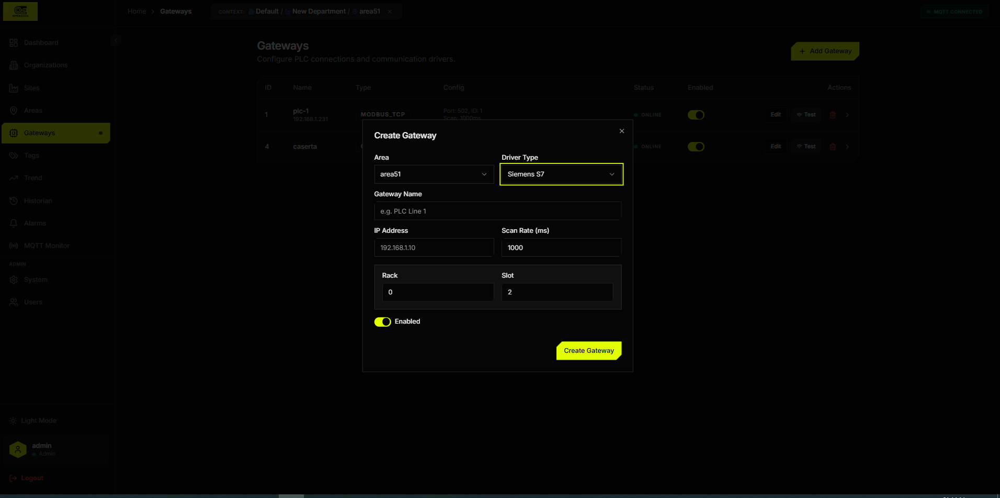
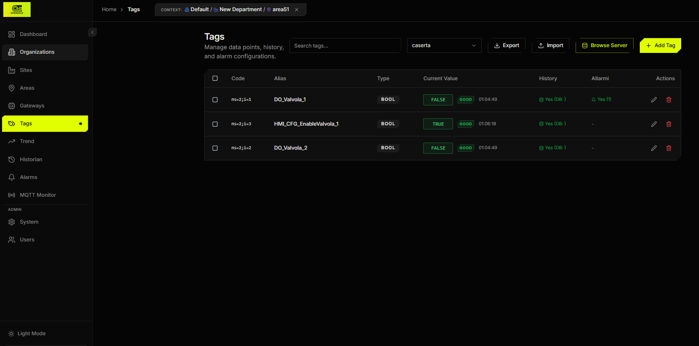
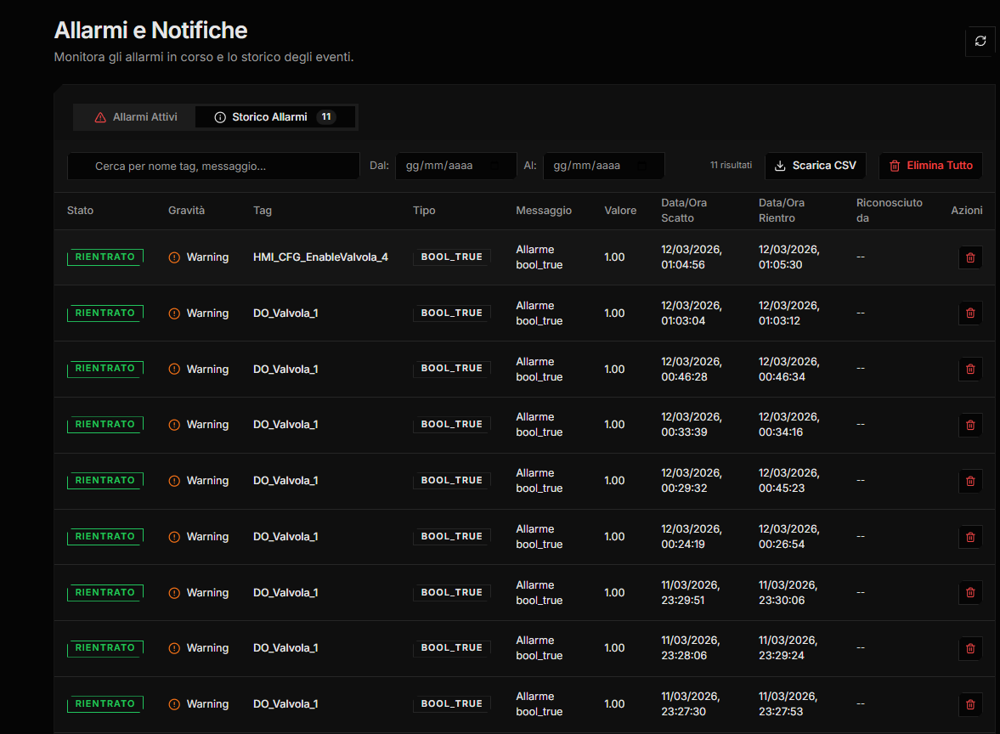
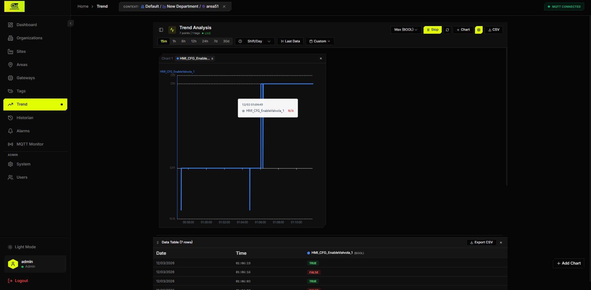
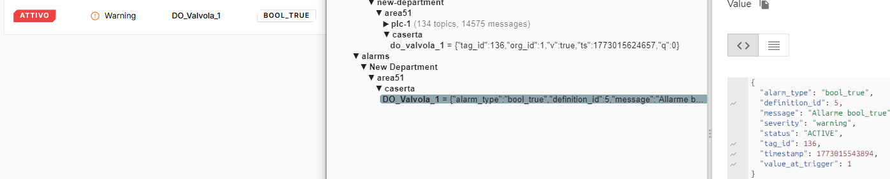
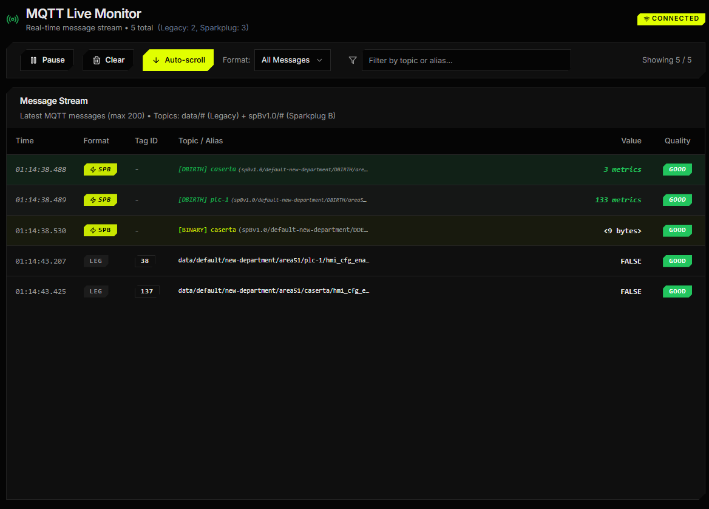

<div align="center">


# OpenEdge Industrial Edge Middleware

**Production-Ready Industrial IoT Edge Computing Platform**

[](https://golang.org/)
[](LICENSE)
[](https://www.docker.com/)

⚡ **High-Performance** • 🏭 **Industrial-Grade** • 🔒 **Secure** • 📊 **Real-Time Analytics**

</div>

---

## 📸 Screenshots

<table>
  <tr>
    <td align="center"><b>Dashboard Gateway</b></td>
    <td align="center"><b>Tags Management</b></td>
  </tr>
  <tr>
    <td></td>
    <td></td>
  </tr>
  <tr>
    <td align="center"><b>Alarm System</b></td>
    <td align="center"><b>Trend & History</b></td>
  </tr>
  <tr>
    <td></td>
    <td></td>
  </tr>
  <tr>
    <td align="center"><b>MQTT broker Pub.</b></td>
    <td align="center"><b>MQTT Monitor</b></td>
  </tr>
  <tr>
    <td></td>
    <td></td>
  </tr>
</table>

---

## 🚀 Overview

**OpenEdge** is a professional-grade edge computing middleware designed for industrial IoT applications. It bridges the gap between industrial PLCs/field devices and cloud systems, providing real-time data collection, alarm management, and secure cloud synchronization.

### Key Features

- **🔄 Multi-Protocol Support**: Modbus TCP, Siemens S7, OPC UA, MQTT, Redis
- **⚡ Real-Time Data Processing**: Sub-millisecond latency with Redis caching
- **🚨 Advanced Alarm System**: Configurable thresholds, delays, and hysteresis
- **📡 Cloud Sync**: Bidirectional MQTT forwarding with Sparkplug B support
- **🔒 End-to-End Security**: AES-256 encryption, authentication, TLS support
- **📊 Time-Series Database**: TimescaleDB integration with automatic retention policies
- **🎨 Modern Web UI**: React-based dashboard with dark/light themes
- **🐳 Production-Ready**: Docker Compose deployment, health checks, auto-reconnection

---

## 📋 Table of Contents

- [Screenshots](#-screenshots)
- [Quick Start](#-quick-start)
- [Architecture](#-architecture)
- [How Drivers Work](#-how-drivers-work)
- [Database Migrations](#-database-migrations)
- [Configuration](#-configuration)
- [Deployment](#-deployment)
- [API Documentation](#-api-documentation)
- [Development](#-development)
- [Troubleshooting](#-troubleshooting)
- [Contributing](#-contributing)
- [License](#-license)

---

## 🎯 Quick Start

**Get OpenEdge running in under 5 minutes:**

```bash
# 1. Clone the repository
git clone https://github.com/inferis995/openedge.git
cd openedge

# 2. Build all images and start services
make start

# 3. Open the web UI
# http://localhost:3000  —  Login: admin / admin123
```

> **Windows users** (no `make`): use the PowerShell script instead:
> ```powershell
> .\scripts\start-industrial-edge.ps1
> ```

**That's it!** The system automatically:
- ✅ Initializes PostgreSQL with TimescaleDB
- ✅ Creates all database tables and indexes
- ✅ Sets up the default admin user
- ✅ Configures the MQTT broker
- ✅ Starts Redis caching
- ✅ Builds all driver images (Modbus, S7, OPC UA, MQTT, Redis)
- ✅ Launches all microservices

No manual database setup, no configuration files to edit, no dependencies to install.

### Services Started

| Service | Port | Description |
|---------|------|-------------|
| Web UI | 3000 | React dashboard |
| Core API | 8081 | REST API & WebSocket |
| Mosquitto | 18830 | MQTT broker |
| PostgreSQL | 5432 | TimescaleDB |
| Redis | 6379 | Cache & real-time data |

### Default Credentials

- **Username:** `admin`
- **Password:** `admin123` ← change this after first login!

---

## 🏗️ Architecture

```
┌─────────────────────────────────────────────────────────────┐
│                         OpenEdge                            │
├─────────────────────────────────────────────────────────────┤
│                                                               │
│  ┌─────────────┐    ┌──────────────┐    ┌──────────────┐  │
│  │   Drivers   │───▶│Engine Historian│───▶│  Cloud Sync  │  │
│  │             │    │              │    │              │  │
│  │ • Modbus    │    │ • Real-time   │    │ • Sparkplug B│  │
│  │ • S7        │    │   History     │    │ • Forwarding │  │
│  │ • OPC UA    │    │ • Alarms      │    │ • Commands   │  │
│  │ • MQTT      │    │ • Deadband    │    │              │  │
│  │ • Redis     │    │ • Compression │    │              │  │
│  └─────────────┘    └──────────────┘    └──────────────┘  │
│         │                                      │           │
│         ▼                                      ▼           │
│  ┌─────────────┐    ┌──────────────┐    ┌──────────────┐  │
│  │  PostgreSQL │    │    Redis     │    │  Cloud MQTT  │  │
│  │ TimescaleDB │◀──▶│    Cache     │    │              │  │
│  └─────────────┘    └──────────────┘    └──────────────┘  │
│                                                               │
└─────────────────────────────────────────────────────────────┘
```

---

## ⚙️ How Drivers Work

Drivers (Modbus, S7, OPC UA, MQTT, Redis) are **not started automatically**.
They are Docker images that `driver-manager` spawns **on demand** when you
create a Gateway in the web UI.

```
You create Gateway  →  driver-manager starts driver container with GATEWAY_ID
You delete Gateway  →  driver-manager stops and removes the container
```

This means:
- **0 driver containers** when no gateways are configured — this is normal
- Each gateway gets its own isolated driver container
- Driver images must be built before the system starts (handled by `make start`)

---

## 🗄️ Database Migrations

This project uses **goose** for database migrations.

```bash
# Check migration status
make migrate-status

# Apply pending migrations
make migrate

# Rollback last migration
make migrate-down
```

---

## ⚙️ Configuration

### Environment Variables

```bash
# Database
DB_HOST=postgres
DB_PORT=5432
DB_USER=industrial_user
DB_PASSWORD=industrial_pass
DB_NAME=industrial_edge

# MQTT
MQTT_HOST=mosquitto
MQTT_PORT=1883

# Redis
REDIS_HOST=redis
REDIS_PORT=6379

# Cloud Sync (Optional)
CLOUD_SYNC_ENABLED=false
CLOUD_MQTT_HOST=
CLOUD_MQTT_PORT=1883
CLOUD_MQTT_USERNAME=
CLOUD_MQTT_PASSWORD=
CLOUD_MQTT_TOPIC=

# Encryption (Optional)
ENCRYPTION_KEY= # 32-character key for AES-256
```

---

## 🚀 Deployment

### Quick Start (Recommended)

```bash
# Clone
git clone https://github.com/inferis995/openedge.git
cd openedge

# Build driver images + start all services
make start

# Check status
docker-compose ps

# View logs
make logs
```

### Useful Commands

```bash
make start    # First run: build images + start services
make up       # Start services (if images already built)
make down     # Stop all services
make restart  # Stop + start
make logs     # Follow logs
make clean    # Stop + delete all data (full reset)
```

### Manual (without make)

```bash
# Build all images including drivers
docker-compose -f docker-compose.yml -f docker-compose.build.yml build

# Start services
docker-compose up -d

# Stop
docker-compose down
```

### System Requirements

**Minimum:**
- CPU: 2 cores
- RAM: 4 GB
- Disk: 20 GB SSD
- Docker Desktop installed

**Recommended (100+ tags):**
- CPU: 4 cores
- RAM: 8 GB
- Disk: 100 GB SSD

---

## 📚 API Documentation

### REST API Endpoints

```
GET  /api/health          # Health check
GET  /api/tags            # List all tags
GET  /api/tags/:id        # Get tag details
POST /api/tags/:id/write  # Write tag value
GET  /api/alarms          # List alarms
GET  /api/history         # Historical data
GET  /api/system          # System settings
PUT  /api/system          # Update settings
```

### WebSocket

```
ws://localhost:8081/ws/realtime
```

Real-time tag value updates, alarm notifications, and system events.

---

## 🛠️ Development

### Prerequisites

```bash
# Install Go dependencies
go mod download

# Install UI dependencies
cd services/web-ui
npm install
```

### Build Services

```bash
# Build all Go services
go build ./services/...

# Build UI
cd services/web-ui
npm run build
```

---

## 🔧 Troubleshooting

### Common Issues

**1. Driver containers crash with "GATEWAY_ID required"**

This is normal if you ran `docker-compose up -d` directly.
Driver images must be built before they can be used by driver-manager.
Use `make start` instead — it builds all images first, then starts services.
Driver containers are started by driver-manager only when you create a Gateway.

**2. Login fails with "Invalid Credentials"**

Database schema may be outdated. Run:
```bash
make migrate-status
make migrate
```

**3. Services cannot connect to the database**

Symptom: `failed to ping database: pq: SSL is not enabled on the server`

Solution: Ensure `DB_SSLMODE=disable` is set for all services in docker-compose.yml.

**4. Mosquitto connection issues**

```bash
docker-compose ps mosquitto
docker-compose logs mosquitto
```

**5. Full reset (clear all data)**

```bash
make clean
make start
```

### Getting Help

- Check logs: `make logs` or `docker-compose logs -f [service-name]`
- Open an issue: https://github.com/inferis995/openedge/issues

---

## 🤝 Contributing

1. Fork the repository
2. Create a feature branch (`git checkout -b feature/amazing-feature`)
3. Commit your changes
4. Push and open a Pull Request

---

## 📜 License

MIT License — see [LICENSE](LICENSE).

---

<div align="center">

**Made with ❤️ for the Industrial IoT Community**

</div>
